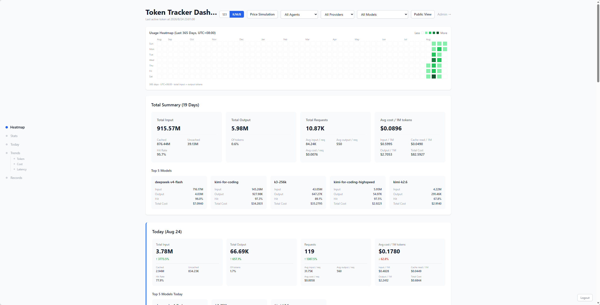
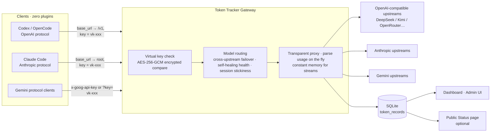

# Token Tracker — Personal AI Gateway

[中文](./README.md) · [CI (main)](https://github.com/caibingcheng/token-tracker/actions/workflows/docker.yml) · [Docker Image](https://ghcr.io/caibingcheng/token-tracker)

A lightweight personal AI Gateway: unify access to multiple upstream LLM APIs (OpenAI-compatible / Anthropic / Gemini) behind a single set of standard protocol endpoints, proxy requests and responses transparently, and automatically parse and record token usage along the way. Ships with a Token Usage Dashboard and an admin UI.

**Auto-accounting personal AI gateway**: transparent pass-through for OpenAI / Anthropic / Gemini, streaming and non-streaming token usage parsed automatically and attributed per virtual key — zero plugins, clients only change `base_url` and key



## Architecture



## Why this project · Who it's for

When you run AI agents on multiple devices, it's useful to have a real usage ledger — how many tokens of each kind, how much cache hit, which model is fast, what it all costs. Plugin-based recording can't see the full traffic, and enterprise gateways are overkill. So all traffic flows through this gateway entry point, where accounting happens transparently during pass-through — clients never notice.

**Good for**: individual users, heavy multi-device + multi-agent usage, wanting bill-level statistics (cache / latency / cost), and preferring **paid APIs** (stable, with someone to complain to).

**Not for**: team multi-tenant management, or aggregating free API quotas — for those, see other mature alternatives.

## Comparison with other options

I've tried a number of existing solutions (LiteLLM, NEW API, OmniRoute — all great), but for personal use I wanted something simpler. So I built a minimal one around my actual needs:

- **Token stats** — auto-parsed for all three protocols streaming and non-streaming, cache read/write tracked separately, attributed per virtual key
- **Latency stats** — per-record latency + streaming TTFT, aggregated by model/date
- **Price simulation & cost estimation** — models.dev official prices auto-matched, see cost directly on the dashboard, and simulate price differences between models
- **Single container** — Docker + SQLite, zero external dependencies; clients only change `base_url` and key

## Features

**Proxying**

- Multi-protocol catch-all pass-through: OpenAI / Anthropic / Gemini, body forwarded unchanged
- Cross-upstream failover: multiple keys per upstream, auth errors switch upstream/key immediately; no retry once streaming has started
- Self-healing health: upstream- and model-level unavailability markers, periodic probes restore automatically
- Session stickiness: requests of the same session pin to one upstream, migrate gracefully on failure
- HTTP CONNECT proxy: optional egress proxy per upstream (stored AES-256-GCM encrypted)
- Manual routing rules: virtual model name → target upstream + real model name

**Accounting & statistics**

- Streaming usage parsed incrementally (O(1) memory, no full body buffered)
- cache read / cache write tracked separately with a unified convention (input excludes cache read)
- Per-record latency + streaming TTFT (time to first token), aggregated by model/date with p50
- Usage dashboard: 365-day heatmap / N-day trends / 24h distribution / top models & providers / cost / latency, grouped by browser timezone
- Quotas: per-virtual-key rpm / tpm / daily / monthly limits, 429 without forwarding when exceeded
- Cost estimation: models.dev official price snapshot auto-matched + auto-filled; historical cost recomputed instantly after pricing

**Admin UI**

- Upstreams / virtual keys / manual routing rules / model pricing / audit logs
- Model alias normalization (display-level rollup), provider anonymization groups, hidden sources (hide vs exclude are independent dimensions)
- Public status page: opt-in, aggregate usage only — never leaks model names or cost details

**Security**

- TOTP two-factor auth + one-time recovery codes (hashes only)
- All secrets stored AES-256-GCM encrypted; a DB leak doesn't leak plaintext
- SSRF protection (private/loopback/metadata addresses rejected), XFF spoofing protection, rate-limited login/setup
- Audit log for every admin action; setup wizard is fail-open, public page is fail-closed

## Quick Start (Docker)

```bash
docker pull ghcr.io/caibingcheng/token-tracker:latest
cp docker-compose.example.yml docker-compose.yml
# Edit docker-compose.yml: set ADMIN_API_KEY, GATEWAY_SECRET, SQLITE_DATABASE_PATH
docker compose up -d
```

First run, three steps:

1. Open `http://host:3000/admin` and log in with a key from `ADMIN_API_KEY` (if unset, a first-run setup wizard appears)
2. Add an upstream (name, protocol, Base URL), configure its API key, and fetch/select the models to enable
3. Create a virtual key and configure your client as in the table below

## Client Setup

| Client | Configuration |
|---|---|
| OpenAI-compatible (Codex / OpenCode, etc.) | `base_url = http://host:3000/v1`, `api_key = vk-xxx` |
| Claude Code (Anthropic protocol) | `ANTHROPIC_BASE_URL = http://host:3000`, `ANTHROPIC_AUTH_TOKEN = vk-xxx` |
| Gemini-protocol clients | `base_url = http://host:3000`, key via `x-goog-api-key` or `?key=` |

Virtual keys (the `vk-` prefix) are created in `/admin`. Sharing one key across devices does not distinguish between devices — create one key per device if you need that.

## Development & Testing

```bash
npm install
cp .env.example .env.local   # required: SQLITE_DATABASE_PATH, GATEWAY_SECRET
npm run dev                  # http://localhost:3000
npm test                     # vitest unit tests (55 test files covering proxy chain/parsers/routing/crypto/auth)
npm run lint
```

The SQLite database is created automatically on the first request (with incremental migrations); no manual setup needed.

## API Overview

| Route | Auth | Description |
|---|---|---|
| `/v1/*`, `/v1beta/*` | Virtual key | Proxy entry points (pass-through) |
| `/api/auth/login` | Raw API key (+ optional TOTP) | Login to exchange for a session token |
| `/api/dashboard` and other stats APIs | Session token (`X-API-Key` header) | Dashboard data |
| `/api/admin/*` | Session token | Admin operations |
| `/admin`, `/` | Page + session token | Admin UI / Dashboard |

> All `/api/*` routes (except `login`) only accept the session token obtained from login. Script example:
> ```bash
> TOKEN=$(curl -s -X POST http://host:3000/api/auth/login \
>   -H 'Content-Type: application/json' \
>   -d '{"apiKey":"your-api-key"}' | jq -r .token)
> curl -s http://host:3000/api/dashboard -H "X-API-Key: $TOKEN"
> ```

## Environment Variables

| Variable | Required | Description |
|---|---|---|
| `SQLITE_DATABASE_PATH` | Yes | Path to the SQLite database file |
| `ADMIN_API_KEY` | Suggested | Admin API keys, comma-separated; if unset and the DB has no key, a first-run setup wizard appears (legacy name `API_KEYS` deprecated) |
| `GATEWAY_SECRET` | Yes | Gateway master key (AES-256-GCM), generate with `openssl rand -hex 32`; if missing, the proxy and admin APIs return 503 |
| `HIDDEN_PROVIDERS` | No | Providers to anonymize; group syntax `name:p1,p2` (multiple groups separated by `;`) |
| `SESSION_TOKEN_TTL_HOURS` | No | Session token lifetime (hours, default 24, sliding renewal) |
| `TRUSTED_PROXY` | No | Set to true when a reverse proxy sets `X-Real-IP`, restoring precise IP rate limiting |
| `API_CACHE_TTL_MS` | No | SELECT cache TTL (ms, default 10000) |
| `GATEWAY_MAX_BODY_MB` | No | Max proxy request body (MB, default 32) |
| `ALLOW_PRIVATE_UPSTREAMS` | No | Allow upstreams pointing at private/loopback addresses (escape hatch for self-hosted LLMs) |

## Security Notes

> **⚠️ First-run wizard (fail-open)**: if `ADMIN_API_KEY` is not set and the DB has no key, anyone who can reach the web UI can be the first to claim the admin key. **In production, always set `ADMIN_API_KEY`**, or protect the first-configuration window with a firewall / internal network. The wizard's rate limiting only prevents brute force, not first-run takeover.

Forgot the login key? Delete the `admin_api_key` row from the SQLite `settings` table to fall back to the `ADMIN_API_KEY` env.

## License

MIT