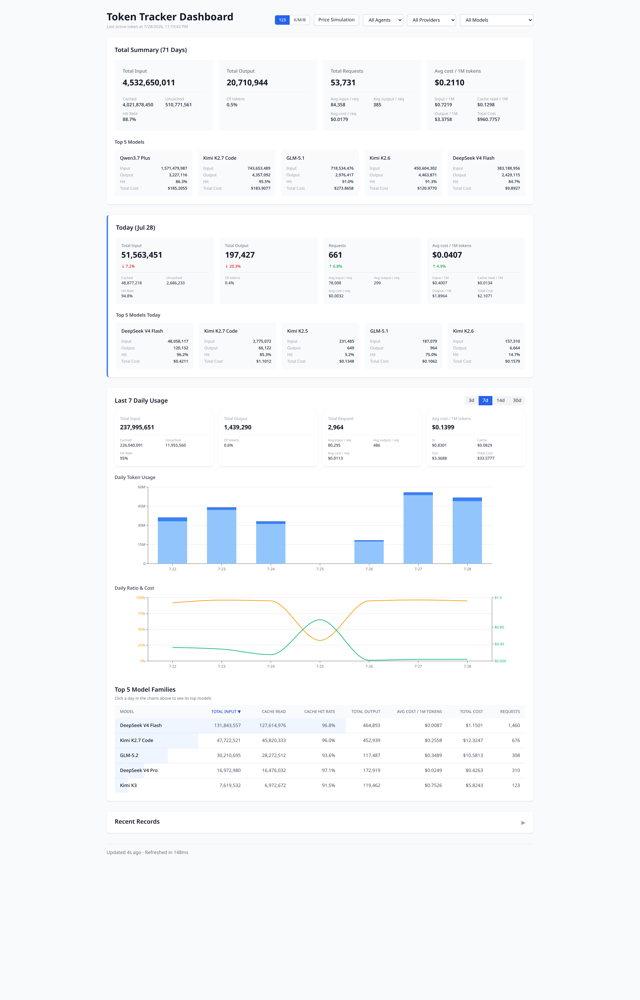

# Token Tracker — Personal AI Gateway

轻量级个人 AI Gateway：统一接入多个上游 LLM API（OpenAI 兼容 / Anthropic / Gemini），对外提供标准协议入口，纯透传请求/响应，并在透传过程中自动解析、记录 token 用量。自带 Token Usage Dashboard 与管理界面。



## 特点

- **多协议透传**：`/v1/*`（OpenAI / Anthropic）、`/v1beta/*`（Gemini）catch-all 路由，不改 body、不转换协议
- **零插件接入**：客户端只需修改 `base_url` 和 key，无需安装任何插件
- **自动记账**：从响应（流式/非流式）自动解析 input / output / cache token，按虚拟 key 归属到 agent
- **上游多 key 故障转移**：单上游支持多个 key，429/5xx/超时自动切换，流式开始后不再重试
- **虚拟 key**：AES-256-GCM 加密存储，可单独吊销，name 即统计维度
- **管理界面**：`/admin` 配置上游、拉取模型、管理虚拟 key、查看用量

## 客户端接入

| 客户端 | 配置 |
|---|---|
| OpenAI 兼容（Codex / OpenCode 等） | `base_url = http://host:3000/v1`，`api_key = vk-xxx` |
| Claude Code（Anthropic 协议） | `ANTHROPIC_BASE_URL = http://host:3000`，`ANTHROPIC_AUTH_TOKEN = vk-xxx` |
| Gemini 协议客户端 | `base_url = http://host:3000`，key 放 `x-goog-api-key` 或 `?key=` |

虚拟 key（`vk-` 前缀）在 `/admin` 创建。同一 key 多设备共用不区分设备。

## Deploy with Docker (VPS)

### Prerequisites

- Docker and Docker Compose installed

### Quick Start

```bash
docker pull ghcr.io/caibingcheng/token-tracker:latest
cp docker-compose.example.yml docker-compose.yml
# 编辑 docker-compose.yml：设置 ADMIN_API_KEY、GATEWAY_SECRET、SQLITE_DATABASE_PATH
docker compose up -d
```

首次启动后：

1. 打开 `http://host:3000/admin`，用 `ADMIN_API_KEY` 中的任意一个 key 登录（未配置时出现首次设置向导）
2. 添加上游（名称、协议、Base URL），配置 API Key，拉取/勾选启用模型
3. 创建虚拟 key，按上表配置客户端即可

### Environment Variables

| Variable | Required | Description |
|----------|----------|-------------|
| `SQLITE_DATABASE_PATH` | Yes | SQLite 数据库路径（默认 `/app/data/token-tracker.db`） |
| `ADMIN_API_KEY` | 启动前建议 | 管理面 API Key，逗号分隔（Dashboard / admin / 统计 API 均需；未配置且 DB 无 key 时出现首次设置向导）。旧名 `API_KEYS` 兼容（deprecated） |
| `GATEWAY_SECRET` | Yes | 网关主密钥，AES-256-GCM（32 字节 hex/base64，用 `openssl rand -hex 32` 生成）；缺失时代理与 admin API 返回 503 |
| `HIDDEN_PROVIDERS` | No | 需要在 UI 匿名化的 provider |
| `API_CACHE_TTL_MS` | No | SELECT 缓存 TTL（毫秒，默认 10000） |
| `API_CACHE_MAX_SIZE` | No | 缓存最大条目数（默认 1000） |

SQLite 数据库文件在首次请求时自动创建（含增量迁移），无需手动操作。

> **⚠️ 首次设置向导安全提示**：未配置 `ADMIN_API_KEY` 且 DB 无 key 时，任何能触达 Web 端的人
> 都可先到先得地设置 admin key（fail-open 设计）。**生产环境请务必设置 `ADMIN_API_KEY`
> env 或通过防火墙/内网隔离保护首次配置窗口**。向导限流只防爆破，不防首次接管。

## Development

```bash
npm install
cp .env.example .env.local
# 必需：SQLITE_DATABASE_PATH、GATEWAY_SECRET
npm run dev
npm test        # vitest 单元测试
npm run lint
```

## API 一览

| 路由 | 认证 | 说明 |
|---|---|---|
| `/v1/*`, `/v1beta/*` | 虚拟 key | 代理入口（透传） |
| `/api/auth/login` | 原始 API key（+ 可选 TOTP） | 登录换会话 token |
| `/api/dashboard` 等统计 API | 会话 token（`X-API-Key` header） | Dashboard 数据 |
| `/api/admin/*` | 会话 token | 上游 / 虚拟 key / 安全设置管理 |
| `/admin` | 页面 + 会话 token | 管理界面 |
| `/` | 页面 + 会话 token | 用量 Dashboard |

> 所有 `/api/*`（login 除外）只接受登录换取的会话 token。脚本调用示例：
> ```bash
> TOKEN=$(curl -s -X POST http://host:3000/api/auth/login \
>   -H 'Content-Type: application/json' \
>   -d '{"apiKey":"your-api-key"}' | jq -r .token)
> curl -s http://host:3000/api/dashboard -H "X-API-Key: $TOKEN"
> ```
>
> 忘记登录 key 无法登录时：删除 SQLite `settings` 表中的 `admin_api_key` 行即回退到 env `ADMIN_API_KEY` 兜底。

## License

MIT
