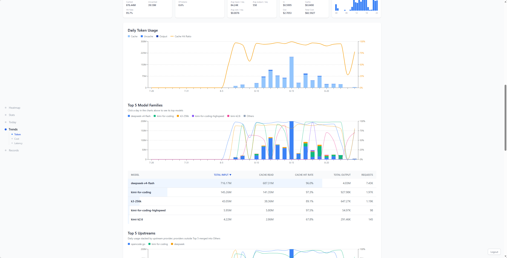
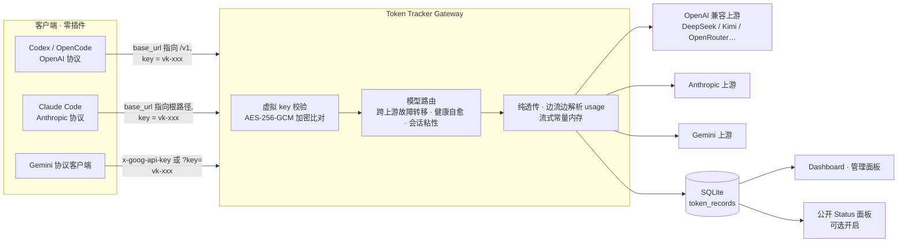

# Token Tracker — 个人 AI Gateway

[English](./README.en.md) · [CI (main)](https://github.com/caibingcheng/token-tracker/actions/workflows/docker.yml) · [Docker 镜像](https://ghcr.io/caibingcheng/token-tracker)

一个轻量级个人 AI Gateway：把多个上游 LLM API（OpenAI 兼容 / Anthropic / Gemini）统一到一个标准协议入口后面，透明转发请求与响应，并在透传过程中自动解析、记录 token 用量。自带用量仪表盘与管理面板。

**自动记账的个人 AI 网关**：OpenAI / Anthropic / Gemini 三协议纯透传，流式/非流式 token 用量自动解析归因——客户端零插件，只改 `base_url` 和 key




## 架构一览



## 为什么做它 · 适合谁

日常在多个设备上用各种 AI agent 时，想要一份真实的用量账本——每类 token 花了多少、缓存命中多少、哪个模型快、成本几何。插件方案记录不到全量流量，商用网关又太重。于是所有流量都改走这个网关入口，记账在透传中完成，客户端毫无感知。

**适合**：个人用户、多设备 + 多 agent 重度使用、想要账单级统计（cache / 延迟 / 成本）、愿意用**付费 API**（稳定、有问题有地方投诉）。

**不适合**：团队多租户管理、免费 API 聚合薅羊毛场景——这部分需求建议用其他的成熟方案。

## 与其他方案的对比

试过不少现成方案（LiteLLM、NEW API、OmniRoute 等都很好用），但是对我来说，我需要更简单的、包含token统计的方案。所以我按自己的实际需求做了一台极简的：

- **token 统计**——三协议流式/非流式自动解析，cache read/write 独立记账，按虚拟 key 归因
- **延迟统计**——逐条 latency + 流式 TTFT，按模型/日期聚合
- **价格模拟与费用估算**——models.dev 官方价自动匹配，仪表盘直接看成本，还能模拟不同模型的价格差
- **单容器部署**——Docker + SQLite，零外部依赖；客户端只改 `base_url` 和 key

## 功能

**代理能力**

- 多协议 catch-all 纯透传：OpenAI / Anthropic / Gemini，body 原样转发
- 跨上游故障转移：每个 upstream 可配多个 key，认证错误立即切换上游/key；流式开始后不重试
- 健康自检自愈：upstream / model 级不可用标记，定时探活自动恢复
- 会话粘性：同会话请求锁定同一 upstream，故障时平滑迁移
- HTTP CONNECT 代理：可选为 upstream 配置代理出口（AES-256-GCM 加密存储）
- 手动路由规则：虚拟模型名 → 目标 upstream + 真实模型名映射

**记账与统计**

- 流式 usage 增量解析（O(1) 内存，不持有完整响应体）
- cache read / cache write 独立列示，口径统一（input 不含 cache read）
- 逐条记录 latency + 流式 TTFT（首 token 时间），按模型/日期聚合 + p50
- 用量仪表盘：365 天热力图 / N 日趋势 / 24h 分布 / Top 模型与 Provider / 成本 / 延迟，按浏览器时区聚合
- 配额控制：每个虚拟 key 可设 rpm / tpm / 日 / 月上限，超限 429 不转发
- 费用估算：models.dev 官方价快照自动匹配 + 自动填充，补价后历史成本立即重算

**管理面板**

- upstreams / 虚拟 keys / 手动路由规则 / 模型定价 / 审计日志
- 模型别名归一化（展示层聚合）、Provider 匿名化分组、Hidden Sources（隐藏/剔除两维度独立）
- 公开 Status 面板：可选开启，只暴露聚合用量，不泄露模型名与成本明细

**安全**

- TOTP 双因素认证 + 一次性恢复码（只存哈希）
- 所有密钥 AES-256-GCM 加密落库，DB 泄露不泄露明文
- SSRF 防护（私网/环回/元数据地址拒绝）、XFF 伪造防护、登录/设置限流
- 审计日志记录全部管理操作；首次设置向导 fail-open、公开面板 fail-closed

## 快速开始（Docker）

```bash
docker pull ghcr.io/caibingcheng/token-tracker:latest
cp docker-compose.example.yml docker-compose.yml
# 编辑 docker-compose.yml：设置 ADMIN_API_KEY、GATEWAY_SECRET、SQLITE_DATABASE_PATH
docker compose up -d
```

首次启动三步：

1. 打开 `http://host:3000/admin`，用 `ADMIN_API_KEY` 登录（未设置时出现首次设置向导）
2. 添加 upstream（名称、协议、Base URL），配置 key，拉取并勾选启用模型
3. 创建虚拟 key，按下表配置客户端

## 客户端接入

| 客户端 | 配置 |
|---|---|
| OpenAI 兼容（Codex / OpenCode 等） | `base_url = http://host:3000/v1`，`api_key = vk-xxx` |
| Claude Code（Anthropic 协议） | `ANTHROPIC_BASE_URL = http://host:3000`，`ANTHROPIC_AUTH_TOKEN = vk-xxx` |
| Gemini 协议客户端 | `base_url = http://host:3000`，key 走 `x-goog-api-key` 或 `?key=` |

虚拟 key（`vk-` 前缀）在 `/admin` 创建。多个设备共用同一个 key 时无法区分设备——需要按设备各建一个 key。

## 开发与测试

```bash
npm install
cp .env.example .env.local   # 必需：SQLITE_DATABASE_PATH、GATEWAY_SECRET
npm run dev                  # http://localhost:3000
npm test                     # vitest 单测（55 个测试文件，覆盖代理链路/解析器/路由/加密/认证等核心模块）
npm run lint
```

SQLite 数据库在首次请求时自动建表 + 增量迁移，无需手动操作。

## API 概览

| 路由 | 认证 | 说明 |
|---|---|---|
| `/v1/*`、`/v1beta/*` | 虚拟 key | 代理入口（纯透传） |
| `/api/auth/login` | 原始 API key（+ 可选 TOTP） | 登录换取会话 token |
| `/api/dashboard` 等统计 API | 会话 token（`X-API-Key` header） | 仪表盘数据 |
| `/api/admin/*` | 会话 token | 管理操作 |
| `/admin`、`/` | 页面 + 会话 token | 管理面板 / 仪表盘 |

> 除 `login` 外，所有 `/api/*` 路由只接受会话 token。脚本示例：
> ```bash
> TOKEN=$(curl -s -X POST http://host:3000/api/auth/login \
>   -H 'Content-Type: application/json' \
>   -d '{"apiKey":"your-api-key"}' | jq -r .token)
> curl -s http://host:3000/api/dashboard -H "X-API-Key: $TOKEN"
> ```

## 环境变量

| 变量 | 必需 | 说明 |
|---|---|---|
| `SQLITE_DATABASE_PATH` | 是 | SQLite 数据库文件路径 |
| `ADMIN_API_KEY` | 建议 | 管理面用 API key，逗号分隔多个；未设置且 DB 无 key 时出现首次设置向导（旧名 `API_KEYS` 已废弃） |
| `GATEWAY_SECRET` | 是 | 网关主密钥（AES-256-GCM），`openssl rand -hex 32` 生成；缺失时代理与管理 API 返回 503 |
| `SESSION_TOKEN_TTL_HOURS` | 否 | 会话 token 有效期（小时，默认 24，滑动续期） |
| `TRUSTED_PROXY` | 否 | 前置反代已设置 `X-Real-IP` 时设为 true，恢复精确 IP 限流 |
| `API_CACHE_TTL_MS` | 否 | SELECT 缓存 TTL（毫秒，默认 10000） |
| `GATEWAY_MAX_BODY_MB` | 否 | 代理请求体上限（MB，默认 32） |
| `ALLOW_PRIVATE_UPSTREAMS` | 否 | 允许 upstream 指向内网/环回地址（内网自建 LLM 逃生开关） |

## 安全提示

> **⚠️ 首次设置向导（fail-open）**：如果 `ADMIN_API_KEY` 未设置且 DB 无 key，任何能访问 Web UI 的人都可以抢先设置管理 key。**生产环境务必设置 `ADMIN_API_KEY`**，或用防火墙 / 内网保护首次配置窗口。向导的限流只能防爆破，不能防抢先注册。

忘记登录 key 时：删除 SQLite `settings` 表中的 `admin_api_key` 行，即回退到 `ADMIN_API_KEY` 环境变量。

## License

MIT